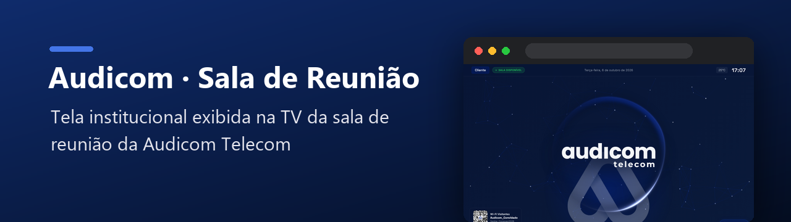
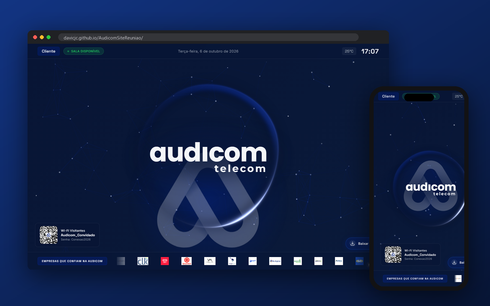

  

  
  
  
  
  

Tela institucional da TV da sala de reunião da Audicom Telecom: relógio, clima, nome do cliente, status da sala, Wi-Fi por QR Code e carrossel de clientes.

  

---

## ✨ O que faz

Feita para ficar aberta na TV da sala de reunião, recebendo visitantes com a identidade da Audicom.

| | |
|---|---|
| 🕒 **Hora, data e temperatura** | Atualizadas em tempo real no topo da tela |
| 🙋 **Nome do cliente** | Clique no nome para editar e dar boas-vindas a quem está chegando |
| 🟢 **Status da sala** | Indicador de *Sala Disponível* / ocupada |
| 📶 **Wi-Fi por QR Code** | Visitante escaneia e já conecta |
| 🏢 **Carrossel de clientes** | Logos dos clientes da Audicom passando continuamente |
| 🌐 **Fundo animado** | Malha de “fibra óptica” desenhada em `canvas`, com brilho e orbe animados |
| ⚙️ **Menu de configurações** | As escolhas ficam salvas no navegador; o cursor some sozinho quando parado |

## 🚀 Como usar

Abra o [site publicado](https://davicjc.github.io/AudicomSiteReuniao/) na TV em tela cheia (`F11`). Sem instalação e sem servidor — é HTML, CSS e JavaScript puro.

## 🗂️ Estrutura

| Arquivo | O que é |
|---|---|
| `index.html` | layout da tela (topo, logo central, QR Code, carrossel) |
| `style.css` | visual e animações |
| `script.js` | relógio, clima, carrossel, canvas de fibra, configurações |
| `assets/` | logos, QR Code do Wi-Fi e logos dos clientes |

---

Desenvolvido por <a href="https://github.com/Davicjc">Davi Castro</a> · <a href="https://davicjc.com">davicjc.com</a> para Audicom Telecom

